<!-- ══════════════════════════════════════════════════════════ -->
<!--              CYBERPUNK GITHUB PROFILE README              -->
<!-- ══════════════════════════════════════════════════════════ -->

<div align="center">

<!-- 1. cyberpunk-banner.svg faylini ham shu repoga upload qiling -->


<br/><br/>


&nbsp;
[](https://github.com/YOUR_USERNAME)
&nbsp;
[](https://github.com/YOUR_USERNAME)

</div>

---

<div align="center">

```yaml
developer:
  name:       "YOUR NAME"
  location:   "Uzbekistan 🇺🇿  |  UTC+5"
  role:       "Full Stack Developer"
  experience: "3+ yil"
  status:     "open_to_work: true  |  freelance: available"

currently:
  building:   "Scalable web applications"
  learning:   "AI/ML integrations & Cloud-native systems"
  passion:    "Clean architecture & High-performance APIs"

quote:        "First, solve the problem. Then, write the code."
```

</div>

---

<div align="center">

## ⚡ TECH STACK

**Frontend**


**Backend**


**Database & Cache**


**DevOps & Cloud**


</div>

---

<div align="center">

## 📊 GITHUB STATS


&nbsp;


<br/>

[](https://git.io/streak-stats)

</div>

---

<div align="center">

## 🏆 TROPHIES

[](https://github.com/ryo-ma/github-profile-trophy)

</div>

---

<div align="center">

## 📈 ACTIVITY GRAPH

[](https://github.com/ashutosh00710/github-readme-activity-graph)

</div>

---

<div align="center">

```bash
~/dev $ whoami
  ➜  problem_solver | lifelong_learner | open_source_contributor

~/dev $ git log --oneline -3
  ➜  a1b2c3d  feat: ship new feature ✓
  ➜  d4e5f6g  fix: squashed that bug 🐛
  ➜  h7i8j9k  chore: coffee.refill() ☕

~/dev $ █
```

</div>

---

<div align="center">

## 🔗 CONNECT WITH ME

[](https://t.me/YOUR_TELEGRAM)
[](https://linkedin.com/in/YOUR_LINKEDIN)
[](mailto:YOUR@EMAIL.COM)
[](https://your-site.dev)
[](https://instagram.com/YOUR_INSTAGRAM)

<br/>


</div>
